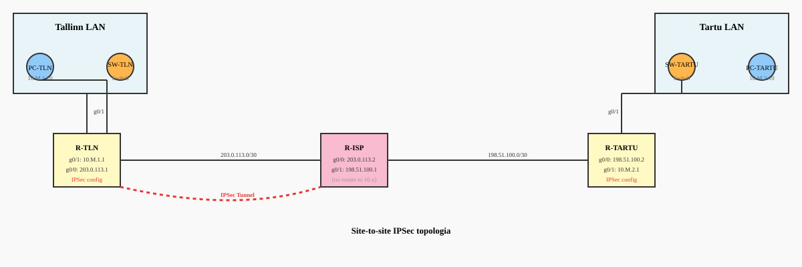
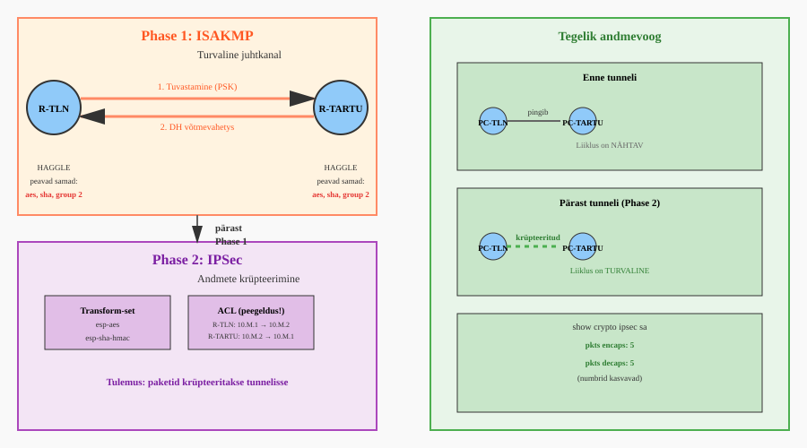

# Site-to-site IPSec VPN — iseseisev e-õpe

**Kursus:** Arvutivõrgud II | **Keskkond:** Cisco Packet Tracer | **Tase:** Iseseisev töö  
**Sihtrühm:** Kutseõpilased | **Kestus:** ~4 akadeemilist tundi

---

## Mida sa pärast seda tead ja oskad

- selgitad, miks IPSec kasutab kahte faasi ja mida kumbki teeb
- seadistad site-to-site IPSec-tunneli mõlemas otsas iseseisvalt
- kontrollid `show crypto` väljundist, kas tunnel töötab ja miks mitte
- leiad ja parandate tüüpilised IPSec-vead

---

## Teooria — loe enne kui Packet Tracerit avad

### Sissejuhatus: Miks on IPSec-tunnel vajalik?

Oletame, et Tallinna kontoris (10.M.1.0/24) ja Tartu kontoris (10.M.2.0/24) on arvutid, mis peavad omavahel rääkima. Näiteks Tallinna töötaja saadab Tartu andmebaasile päringuid, või Tartu pank saadab Tallinna kontosse raha. Nende kahe kontori vahel on aga **avalik Internet** — täiesti ebaturvaline koht.

Miks on Internet ebaturvaline? Kujuta ette, et saadad kirja. Postipakist saab keegi kirja lahti lugeda, sisu muuta, ja siis edasi saata. Samuti toimib Internet. Kui saadame andmeid otse Internet kaudu (näiteks HTTP-s või lihtsalt IP-ga), näeb seda iga vahestaja, kes paketi teel käsitleb:

- **Interneti teenuse pakkuja** (ISP, näiteks Telia) — näeb sinu liiklust
- **Võrguseadmete haldajad** vahepeal — teiste ISP-de ruuterid, pääsupunktid, jne.
- **Pahatahtlikud isikud**, kes on näiteks ISP-de võrgusse sisenetud

Kõik nad näevad: "Tallinna arvutilt Tartu arvutile saadeti see fail, see parool, see pangaülekande teave."

**Lahendus:** VPN-tunnel — krüpteeritud "toru" privaatse liikluse jaoks. IPSec on Cisco standardne viis sellist tunneli luua. VPN tähendab "Virtual Private Network" — kujuteldav privaatne võrk, mida ehitame avaliku interneti peale.

Aga IPSec-tunnel ei teki ühe käsuga. Kahe ruuteri vahel toimub hoolikas mitmeastmeline protsess. Miks nii keeruline? Sellepärast, et ruuterid peavad kõigepealt üksteist **usaldama**, siis **salajasi kokku lepima**, ja alles siis andmeid **krüpteerima**. See juhtub kolmes järgus:

```
1. Phase 1 — Ruuterid tuvvastavad üksteist ja loovad TURVALISE halduskanali
   (nagu kaks spiooni, kes veenduvad, et teine on õige inimene)

2. Phase 2 — Über halduskanali lepivad kokku, kuidas andmeid krüpteerida
   (nagu spionid, kes lepivad salakoodis)

3. Andmekanal — Nüüd saab liiklust krüpteeritud kujul saata
   (nüüd saavad kirjad läbi postiga, aga krüpteeritud)
```

**Parim analoogia:** Kujuta ette diplomaatide kohtumist. Esiteks peavad nad veenduma, et nad on õiged inimesed — seda kutsutakse Phase 1-ks. Seejärel lepivad kokku, kuidas kommunikeerida — näiteks mõni salakood. See on Phase 2. Alles seejärel saavad nad tegeliku informatsiooni vahetada. IPSec töötab täpselt nii.

### Phase 1 — ISAKMP ja turvalise juhtimiskanali loomine

Phase 1 eesmärk on luua kahel ruuteril **turvaline side**, et nad saaksid omavahel konfidentsiaalselt kokku leppida, kuidas Phase 2-t seadistada. Teisisõnu: R-TLN ja R-TARTU peaksid võrgusse saata mingi signaali, mida keegi teine ei mõistetaks, ja mille kaudu lepiksite kokku väga salajases salakoodis.

Kuidas see töötab praktikas? Kujuta ette, et R-TLN ja R-TARTU saadavad teineteisele spetsiaalseid pakette, mis sisaldavad võtmeid ja numbreid. Need paketid ise on krüpteeritud, seega keegi vahepeal neist aru ei saa. Aga mõlema ruuteri jaoks on selge, mis nad tähendavad. See on nagu salajane koodi pööripiste sõnumi jaoks.

Selles faasis toimub kolm tähtsat asja:

1. **Seadmete tuvastamine (Authentication):** Ruuterid veenduvad, et teised pool on õige partner. Tavaliselt kasutatakse selleks ühist salasõna (Pre-Shared Key ehk PSK). See on nagu parooli sisestamine — ainult need, kes seda parooli teavad, saavad siseneda. Kui R-TLN ütleb "olen R-TLN, minu salasõna on VPNVOTI", siis R-TARTU kontrollib: "jah, R-TLN salasõna on tegelikult VPNVOTI, seega see on õige inimene."

2. **Ühise võtme genereerimine:** Kasutades Diffie-Hellmani algoritmi, tuletatakse matemaatiliselt ühine salajane võti. Seda võtit ei saadeta kunagi üle võrgu — igaüks arvutab selle ise matemaatiliselt. See on nagu saladus, mille mõlemad pooled "loovad" täisvõrdeliselt iseseisvalt, aga tulemus on sama. Internet-vahestaja näeb vahetusväärtusi, kuid lõppvõtit ei saa.

3. **ISAKMP SA loomine:** Tulemuseks on ISAKMP Security Association — väga lühike turvaline ühendus, mille kaudu saab edaspidi Phase 2 parameetreid kokku leppida. See SA kehtib piiratud aja jooksul (tavaliselt 24 tundi), siis algab uus Phase 1.

Et Phase 1 eduks oleks, peavad **KÕIK parameetrid täpselt ühtima**. Kui isegi ühe parametri väärtused on erinevad, siis Phase 1 ebaõnnestub ja midagi ei tööta. Et meelde jätta, kasuta akronüümi **HAGGLE**:

| Täht | Parameeter | Seletus | Näide |
|------|-----------|---------|--------|
| H | Hash | Tagab andmete tervikluse. Kui keegi teel paketti muudab, muutub hash. Seepärast teame, et andmed on muutunud. | `sha` (SHA-1) |
| A | Authentication | Kuidas ruuterid üksteist tunnevad. Levinuin on ühine salasõna. | `pre-share` |
| G | Group | Diffie-Hellman grupp määrab võtmevahetuse matemaatilise tugevuse. Suurem number = parem turvalisus, aga rohkem arvutamisaega. | `group 2` (Packet Traceris), `group 14` (päriselus) |
| L | Lifetime | Kui kaua Phase 1 ühendus kehtib (sekundites). Kui aeg lõpeb, alustatakse uus Phase 1. | `86400` (24 tundi) |
| E | Encryption | Juhtimiskanali krüpteerimine. Kasuta alati AES. | `aes` (AES-128, piisav) |

**Kõige kriitilisem reegel:** Kui kasvõi üks HAGGLE-parameeter erineb, siis Phase 1 ebaõnnestub ja tunnelit ei teki. See on kõige levinum debugging-probleem.

### Phase 2 — IPSec ja andmete tegelik kaitsmine

Pärast Phase 1 on mõlema ruuteri vahel turvaline "salakõne". Nüüd saavad nad Phase 2 parameetrid kokku leppida.

Phase 2 eesmärk on kaitsta reaalset liiklust. Selleks vajadakse **kolme asja**:

**1. Transform-set** — kirjeldab, kuidas andmeid krüpteeritakse ja hashitakse.

Näide: `esp-aes esp-sha-hmac` tähendab:
- `esp-aes` — kasuta AES-krüpteerimist (ESP protokollis)
- `esp-sha-hmac` — kasuta SHA-i hashimiseks

**2. Interesting Traffic (ACL)** — määrab täpselt, millised paketid peaksid tunnelisse minema.

Näide: R-TLN-l
```
permit ip 10.M.1.0 0.0.0.255 10.M.2.0 0.0.0.255
```
Tähendab: "Kaitsi kõik paketid, mis tulevad Tallinna võrgust ja lähevad Tartu võrku."

**KRIITILISELT TÄHTIS REEGEL:** ACL-id peavad olema **peegeldused** mõlemas otsas.

- R-TLN-l: `10.M.1.0 → 10.M.2.0`
- R-TARTU-l: `10.M.2.0 → 10.M.1.0`

Kui seda ei tee, tunnelit ei teki.

**3. Crypto map** — "liim", mis seob peer-aadresse, transform-seti ja ACL-i kokku. Rakendatakse **avalike liideste** peale (kus Internet on).

### Verifitseerimine — kuidas teada, et tunnel töötab?

Kasuta neid käske:

```
show crypto isakmp sa
```
Otsid `state` veergu. Kui näed `QM_IDLE`, siis Phase 1 töötab. `QM` tähendab "Quick Mode" — see on Phase 2 läbirääkimiste otsustamise režiim.

```
show crypto ipsec sa
```
See on kõige olulisem käsk. Otsid:
- `#pkts encaps` — mitu paketti on krüpteeritud ja välja saadetud
- `#pkts decaps` — mitu paketti on vastu võetud ja dekrüpteeritud

Kui pingid ja need numbrid kasvavad, siis tunnel **tegelikult** töötab.

**Troubleshooting järjekord (alt üles):**
1. Füüsiline ühendus — kaablid on ühendatud, liidese status on `up`
2. IP-side — ruuterid näevad üksteist ping kaudu (avalike aadresside vahel)
3. Phase 1 (HAGGLE) — parameetrid ühtivad, ISAKMP SA tekib
4. Phase 2 (ACL) — ACL-id on peegeldused, crypto map on liidesele rakendatud
5. Encryption — `show crypto ipsec sa` näitab kasvu `encaps`/`decaps` loendureis

---

## Topoloogia skeem



Sinu aadressid (asenda M oma M-numbriga):

| M-number | Tallinn LAN | Tartu LAN |
|----------|-------------|-----------|
| M1 | 10.1.1.0/24 | 10.1.2.0/24 |
| M2 | 10.2.1.0/24 | 10.2.2.0/24 |
| M3 | 10.3.1.0/24 | 10.3.2.0/24 |
| M4 | 10.4.1.0/24 | 10.4.2.0/24 |
| M5 | 10.5.1.0/24 | 10.5.2.0/24 |
| M6 | 10.6.1.0/24 | 10.6.2.0/24 |
| M7 | 10.7.1.0/24 | 10.7.2.0/24 |
| M8 | 10.8.1.0/24 | 10.8.2.0/24 |
| M9 | 10.9.1.0/24 | 10.9.2.0/24 |
| M10 | 10.10.1.0/24 | 10.10.2.0/24 |
| M11 | 10.11.1.0/24 | 10.11.2.0/24 |
| M12 | 10.12.1.0/24 | 10.12.2.0/24 |
| M13 | 10.13.1.0/24 | 10.13.2.0/24 |
| M14 | 10.14.1.0/24 | 10.14.2.0/24 |
| M15 | 10.15.1.0/24 | 10.15.2.0/24 |
| M16 | 10.16.1.0/24 | 10.16.2.0/24 |
| M17 | 10.17.1.0/24 | 10.17.2.0/24 |

Avalikud aadressid (kõigil samad):
- R-TLN ↔ R-ISP: `203.0.113.0/30` (R-TLN = `.1`, R-ISP = `.2`)
- R-ISP ↔ R-TARTU: `198.51.100.0/30` (R-ISP = `.1`, R-TARTU = `.2`)

---

## Phase 1 ja Phase 2 voog



---

## Osa 1 — Ehita topoloogia Packet Traceris

Seadmed ja kaablid:

| Seade | Mudel | Nimi |
|-------|-------|------|
| R-TLN | 1941 | R-TLN-SINUNIMI |
| R-ISP | 1941 | R-ISP |
| R-TARTU | 1941 | R-TARTU-SINUNIMI |
| SW-TLN | 2960 | SW-TLN |
| SW-TARTU | 2960 | SW-TARTU |
| PC-TLN | PC | PC-TLN |
| PC-TARTU | PC | PC-TARTU |

**Kaablid:**

| A | Port | B | Port |
|---|------|---|------|
| PC-TLN | Fa0 | SW-TLN | Fa0/1 |
| SW-TLN | Fa0/24 | R-TLN | g0/1 |
| R-TLN | g0/0 | R-ISP | g0/0 |
| R-ISP | g0/1 | R-TARTU | g0/0 |
| R-TARTU | g0/1 | SW-TARTU | Fa0/24 |
| SW-TARTU | Fa0/1 | PC-TARTU | Fa0 |

---

## Osa 2 — Põhiseadistus (IP-aadressid, marsuuterimine)

**R-TLN seadistamine:**

Enne Phase 1 ja Phase 2 konfigureerimist peavad ruuterid üksteist nägema (avalike aadresside kaudu).

Esiteks: litsents ja reload. Krüptograafia nõuab securityk9 litsentsit.

```
enable
configure terminal
hostname R-TLN-SINUNIMI
license boot module c1900 technology-package securityk9
```

Vasta `yes` küsimusele. Siis:

```
end
copy running-config startup-config
reload
```

Ootel kuni ruuter on uuesti üles. Seejärel:

```
enable
configure terminal
interface g0/1
 ip address 10.M.1.1 255.255.255.0
 no shutdown
 exit
interface g0/0
 ip address 203.0.113.1 255.255.255.252
 no shutdown
 exit
ip route 0.0.0.0 0.0.0.0 203.0.113.2
end
```

**R-TARTU seadistamine:**

Sama litsents-protsess:

```
enable
configure terminal
hostname R-TARTU-SINUNIMI
license boot module c1900 technology-package securityk9
```

`yes`, siis `end`, `copy running-config startup-config`, `reload`.

Pärast relaadi:

```
enable
configure terminal
interface g0/1
 ip address 10.M.2.1 255.255.255.0
 no shutdown
 exit
interface g0/0
 ip address 198.51.100.2 255.255.255.252
 no shutdown
 exit
ip route 0.0.0.0 0.0.0.0 198.51.100.1
end
```

**R-ISP seadistamine:**

R-ISP-l ei ole vaja IPSec-i, seega litsentsit pole vaja.

```
enable
configure terminal
hostname R-ISP
interface g0/0
 ip address 203.0.113.2 255.255.255.252
 no shutdown
 exit
interface g0/1
 ip address 198.51.100.1 255.255.255.252
 no shutdown
 exit
end
```

**PC-sid:**

PC-TLN: IP `10.M.1.10`, mask `255.255.255.0`, gateway `10.M.1.1`
PC-TARTU: IP `10.M.2.10`, mask `255.255.255.0`, gateway `10.M.2.1`

### Kontrolli enne kui edasi lähed

```
R-TLN> ping 198.51.100.2
```

Peab saama sõnum "Reply from 198.51.100.2" — see tähendab, et avalik side töötab.

```
R-TLN> ping 10.M.2.10
```

See **PEAB EBAÕNNESTUMA**. Selle liikluse tunnelisse panekuks seadistame IPSec-i.

---

## Osa 3 — Seadista Phase 1 (ISAKMP) — turvaline juhtkanal

Phase 1 eesmärk: R-TLN ja R-TARTU loovad turvalise juhtkahali, et saaksid kokku leppida Phase 2 parameetreid.

Tee järgmised sammud **mõlemale ruuterile täpselt samad**, ainult peer-aadressid vastupidi.

### Samm 1: Loo ISAKMP poliitika HAGGLE-parameetritega

<details>
<summary>Mis käsk loob ISAKMP poliitika?</summary>

Tee **R-TLN-l:**

```
configure terminal
crypto isakmp policy 10
 encryption aes
 hash sha
 authentication pre-share
 group 2
 lifetime 86400
 exit
```

Tee **R-TARTU-l** täpselt sama:

```
configure terminal
crypto isakmp policy 10
 encryption aes
 hash sha
 authentication pre-share
 group 2
 lifetime 86400
 exit
```

**Seletus:**
- `encryption aes` — kasuta AES
- `hash sha` — SHA-1 hashimiseks
- `authentication pre-share` — ühine salasõna
- `group 2` — Diffie-Hellman grupp (Packet Tracer kasutab seda)
- `lifetime 86400` — 24 tundi

</details>

### Samm 2: Määra pre-shared key

Pre-shared key on salasõna, mis ühendab kaht ruuterit.

**R-TLN-l:** Peer-aadress on R-TARTU's avalik aadress = `198.51.100.2`

<details>
<summary>Mis käsk määrab pre-shared key R-TLN-l?</summary>

```
crypto isakmp key VPNVOTI address 198.51.100.2
```

Key on `VPNVOTI`. See peab **täpselt sama** olema R-TARTU-l.

</details>

**R-TARTU-l:** Peer-aadress on R-TLN's avalik aadress = `203.0.113.1`

<details>
<summary>Mis käsk määrab pre-shared key R-TARTU-l?</summary>

```
crypto isakmp key VPNVOTI address 203.0.113.1
```

Sama key: `VPNVOTI`.

</details>

### Kontrolli Phase 1 seadistust

R-TLN-l:

```
show crypto isakmp policy
```

Sa näed:
```
Protection suite of priority 10
  encryption algorithm   : AES
  hash algorithm         : SHA
  authentication method  : pre-share
  Diffie-Hellman group   : group 2
  lifetime               : 86400 seconds
```

**Võrdle R-TARTU väljundiga** — peab täpselt sama olema.

---

## Osa 4 — Seadista Phase 2 (IPSec) — andmete kaitsmine

Phase 2 eesmärk: määra, **mida** krüpteeritakse ja **kuidas**.

### Samm 3: Loo transform-set

Transform-set määrab krüpteerimis- ja hashimisalgoritmi.

<details>
<summary>Mis käsk loob transform-seti?</summary>

Tee **mõlemale ruuterile** sama käsu:

```
crypto ipsec transform-set VPN-SET esp-aes esp-sha-hmac
```

**Seletus:**
- `VPN-SET` on nime (võib olla iga nimi, aga sama mõlemale poolele)
- `esp-aes` — kasuta AES-krüpteerimist paketitena
- `esp-sha-hmac` — SHA-1 hashimiseks integriteedi kontrolliks

</details>

### Samm 4: Loo Interesting Traffic ACL

ACL määrab, millised paketid lähevad tunnelisse. **Peab olema peegeldus mõlemas otsas.**

<details>
<summary>Mis käsk loob VPN-ACL?</summary>

R-TLN-l (Tallinn → Tartu):

```
ip access-list extended VPN-ACL
 permit ip 10.M.1.0 0.0.0.255 10.M.2.0 0.0.0.255
 exit
```

R-TARTU-l (Tartu → Tallinn — peegeldus!):

```
ip access-list extended VPN-ACL
 permit ip 10.M.2.0 0.0.0.255 10.M.1.0 0.0.0.255
 exit
```

**Peab olema peegeldus:** esimene ja kolmas võrk vahetavad kohta.

</details>

### Samm 5: Loo crypto map ja rakenda liidesele

Crypto map on "liim", mis seob peer-i, transform-seti ja ACL-i. Rakendatakse **g0/0-le** (avalik liides).

<details>
<summary>Mis käsud loovad crypto map ja rakendavad selle?</summary>

R-TLN-l:

```
crypto map VPN-MAP 10 ipsec-isakmp
 set peer 198.51.100.2
 set transform-set VPN-SET
 match address VPN-ACL
 exit
interface g0/0
 crypto map VPN-MAP
 exit
```

R-TARTU-l:

```
crypto map VPN-MAP 10 ipsec-isakmp
 set peer 203.0.113.1
 set transform-set VPN-SET
 match address VPN-ACL
 exit
interface g0/0
 crypto map VPN-MAP
 exit
```

**Oluline:** `crypto map` läheb **g0/0-le**, mitte g0/1-le. g0/0 on avalik liides (kus internet on).

</details>

---

## Osa 5 — Tõsta tunnel üles ja kontrolli

Nüüd peaks tunnel tööle jääma. Tekita liiklust:

PC-TLN-lt:

```
ping 10.M.2.10
```

Esimesed 1–2 pingi võivad kukkuda — tunnel räägitakse samal ajal läbi. Järgmised peavad vastama.

### Kontrolli Phase 1

R-TLN-l:

```
show crypto isakmp sa
```

Sa näed midagi sellist:

```
IPv4 Crypto ISAKMP SA
dst             src             state          conn-id status
198.51.100.2    203.0.113.1     QM_IDLE             1 ACTIVE
```

**`state` peab olema `QM_IDLE`.** See tähendab, et Phase 1 õnnestus ja Quick Mode (Phase 2) võib alata.

### Kontrolli Phase 2

R-TLN-l:

```
show crypto ipsec sa
```

Sa näed midagi sellist:

```
interface: GigabitEthernet0/0
    Crypto map tag: VPN-MAP, local addr 203.0.113.1

 protected vrf: (none)
 local  ident (addr/mask/prot/port): (10.M.1.0/255.255.255.0/ip)
 remote ident (addr/mask/prot/port): (10.M.2.0/255.255.255.0/ip)
 current_peer 198.51.100.2 port 500
 PERMIT, flags={origin_is_acl,}
#pkts encaps: 5, #pkts encrypt: 5, #pkts digest: 5
#pkts decaps: 0, #pkts decrypt: 0, #pkts verify: 0
```

**Otsitavad numbrid:**
- `#pkts encaps: 5` — sinu ruuter on välja saatnud 5 krüpteeritud paketti
- `#pkts decaps: 0` — vastu võetud pakette pole (PC-TARTU pole veel pingitud tagasi)

### Vastused küsimustele

1. **Mis on `show crypto isakmp sa` väljundis `state`? Mida `QM_IDLE` tähendab?**

   State on `QM_IDLE`. QM tähendab "Quick Mode" — see on Phase 2 läbirääkimiste režiim. `IDLE` tähendab, et Phase 1 ühendus on passiivne (ootab Phase 2).

2. **`show crypto ipsec sa` — leia `#pkts encaps` ja `#pkts decaps`. Kas need kasvavad kui uuesti pingid?**

   Kui pingid PC-TARTU-st tagasi, siis `#pkts decaps` hakkab kasvama.

3. **Pingi R-TLN-lt `203.0.113.2` (ISP). Kas `#pkts encaps` kasvab?**

   Ei, see liiklus ei ole VPN-ACL-is (`10.M.1.0` → `10.M.2.0`). Seega ei lähda tunnelisse.

4. **Miks esimene ping Tartu PC-ni kukub, aga järgmised mitte?**

   Esimene ping käivitab Phase 2 läbirääkimised. Pärast seda on tunnel valmis.

---

## Osa 6 — Riku ja paranda

Iga harjutuse järel pane parameetrid tagasi.

### Harjutus A — HAGGLE mismatch

Simuleerida veahakkumise. Muuda R-TARTU-l Group:

```
configure terminal
crypto isakmp policy 10
 group 5
 exit
```

PC-TLN-lt:

```
ping 10.M.2.10
```

**Vaadake:**

```
show crypto isakmp sa
```

Tunnel ei teki. State jääb otsimisel `IKE_SA_SETUP` või sarnanesse olekusse.

**Arusaam:** Group on Phase 1 HAGGLE-s, seega see peatab kogu tunneli.

**Paranda tagasi:**

```
configure terminal
crypto isakmp policy 10
 group 2
 exit
clear crypto isakmp
```

### Harjutus B — Peegeldamata ACL

ACL-id peavad olema peegeldused. Simuleerida viga:

R-TARTU-l muuda ACL:

```
configure terminal
ip access-list extended VPN-ACL
 no permit ip 10.M.2.0 0.0.0.255 10.M.1.0 0.0.0.255
 permit ip 10.M.1.0 0.0.0.255 10.M.2.0 0.0.0.255
 exit
```

PC-TLN-lt:

```
ping 10.M.2.10
```

**Vaadake:**

```
R-TARTU> show crypto ipsec sa
```

Phase 1 õnnestub, aga Phase 2 ei. `#pkts encaps` ja `#pkts decaps` jäävad nullideks.

**Arusaam:** ACL-id määravad interesting traffic. Kui need ei ole peegeldused, ei kattu üheski liidasõlmes.

**Paranda tagasi:**

```
configure terminal
ip access-list extended VPN-ACL
 no permit ip 10.M.1.0 0.0.0.255 10.M.2.0 0.0.0.255
 permit ip 10.M.2.0 0.0.0.255 10.M.1.0 0.0.0.255
 exit
clear crypto sa
```

### Harjutus C — Crypto map eemaldamine

Crypto map on "liim". Eemalda see:

```
configure terminal
interface g0/0
 no crypto map VPN-MAP
 exit
```

PC-TLN-lt:

```
ping 10.M.2.10
```

Pakett jõuab IS P-ni, aga R-ISP ei tea, kuhu edasi.

**Vaadake:**

```
R-TLN> show crypto ipsec sa
```

Ei näita midagi — map pole liidesele rakendatud.

**Paranda tagasi:**

```
configure terminal
interface g0/0
 crypto map VPN-MAP
 exit
clear crypto sa
```

---

## Enesekontroll

Pärast kogu labori:

- [ ] `show crypto isakmp sa` näitab state `QM_IDLE`
- [ ] `#pkts encaps` ja `#pkts decaps` kasvavad pärast pingi
- [ ] PC-TLN pingib `10.M.2.10` edukalt
- [ ] Ping `203.0.113.2` ei panusta `#pkts encaps`-i
- [ ] Hostname sisaldab sinu nime mõlemal ruuteril
- [ ] Kõik kolm riku-harjutust tehtud ja parandat ud

---

## Esitamine

**Screenshots:**

1. `show crypto isakmp sa` (R-TLN)
2. `show crypto ipsec sa` (R-TLN) — nähtavad `#pkts encaps` ja `#pkts decaps`
3. `ping 10.M.2.10` PC-TLN-lt — edukas
4. `show running-config | section crypto` — R-TLN
5. `show running-config | section crypto` — R-TARTU

**Vastused Osa 5 küsimustele:**

Kirjuta lühidalt vastused küsimustele 1–4.


